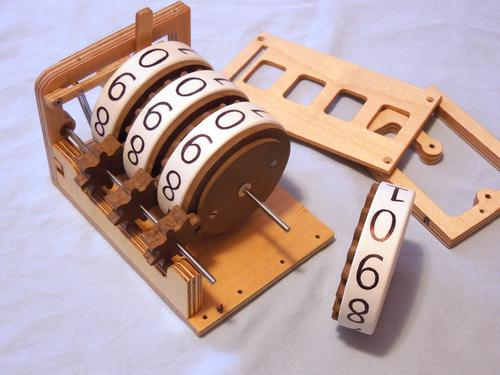

# NUnit-Parameters-Generator
Generate parameters for NUnit tests

## Intro
When you need create better unit tests or just want tests all possibilities, usually you finish with parametrized tests. Sometimes creating TestCase-s is more complicated and you found NUnit generators. It has great possibilities, but creating generator which generate all possible parameters combination isn't easy at all.

This is exactly the point where you need avoid complexity of generators and simply create generator. Intention of this library is simplifing creation of test generators.

## Concept
Testing all combination of parameters is one possible way. But how to generate all possible combination?

Do you what is mechanical counter?

When you don't know here is explanation	[How mechanical counters work](https://youtu.be/rjWfIiaOFR4?feature=shared)

If you imagine variables as one of this digit wheel, then you found principle of generating all combinations. Rest is easy.

You need create line of digit wheels, each for one parameter. Now when you rotate first digit wheel it will rotate next digit wheel.

## Parameters
### SetParamer
It allow us genrates parameters based on predefined set.

### RangePatameter
It generates parameters base on ranges. It is usually numeric value.
